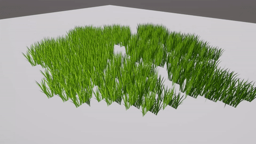
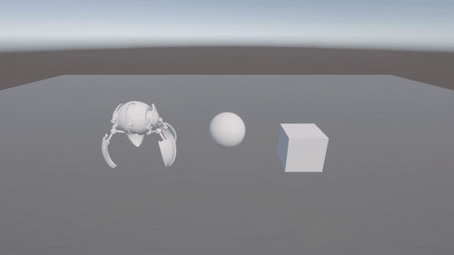
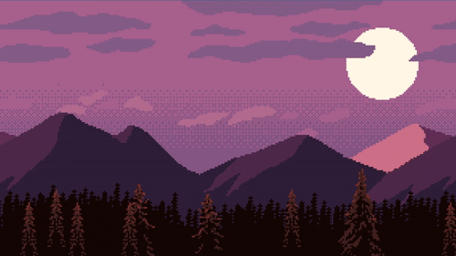

# 🎮 Unity Shader Collection

📖 This README is also available in [Русский](README.ru.md)

This repository contains a collection of shaders for Unity — including **custom-made**, **reproduced from tutorials**, and **adapted from public sources**.

Useful for:
- Visual effects
- Stylization
- Learning and experimenting with shaders

---

## 📦 What's Inside

- ✍️ Original shaders
- 🔁 Recreated shaders based on tutorials and demos
- 🌍 Shaders found in the community and adapted

---

## 🧪 Examples

| Shader               | Preview                   |
|----------------------|---------------------------|
| Grass                |        |
| Dissolve             |     |
| Parallax Background  |           |

---

## 🙏 Credits

Some shaders in this repository were inspired by or adapted from the work of other developers.  
Huge thanks to the following creators:

- [James Doyle](https://www.youtube.com/@JamesDoyle) and his [Shader Graph Course](https://www.udemy.com/course/unity-shader-graph/)